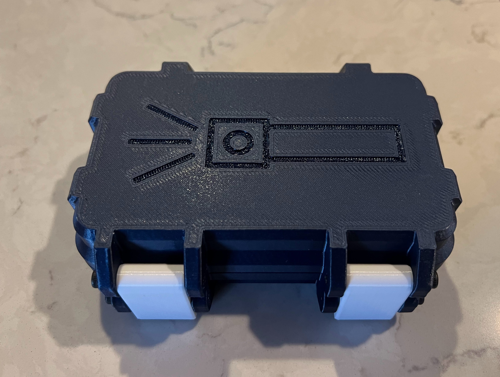
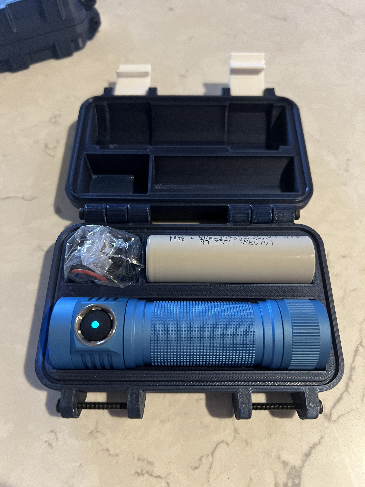

# d4k flashlight rugged box

A rugged box that holds an [emisar d4k flashlight](https://intl-outdoor.com/emisar-d4k-1-21700-high-power-quad-edc-led-flashlight.html) and a spare 21700 battery.

Requires 6 M3x30 screws.

Get the STL files by generating them yourself using OpenSCAD, downloading from [GitHub Releases](https://github.com/justbuchanan/d4k-rugged-box/releases), or on [Printables.com](https://www.printables.com/model/1492671-d4k-flashlight-rugged-box).

This is a remix of [Rugged Storage Box by @bulbasaur0 on printables.com](https://www.printables.com/model/637028-rugged-storage-box-parametric-and-customizable).

## Print Settings

The features that this remix adds don't require anything special print-wise. Refer to the original model (linked above) for settings recommendations.

For reference, here are the details of my printer/settings:

- printer: Prusa Core One
- slicer: PrusaSlicer
- material: PETG
- infill: 15%
- supports: no
- brim: no (might want it for latch, but don't need for top and bottom)
- infill type: gyroid
- nozzle size: 0.4
- layer height: 0.2

filament:

- top/bottom printed in "Starry Blue" Overture PETG
- latches printed in white
